# 🛡️ Vultrax Core // Zero-Knowledge Enterprise Vault

Vultrax Core is a professional-grade Desktop Password Manager built with a **Cyber-Ops** aesthetic and a secure **Zero-Knowledge** architecture. It provides a hardened environment for managing digital identities with transparent local-to-cloud synchronization.

---

## 🔒 Security Architecture (Zero-Knowledge)

Vultrax Core operates on the principle that **only you** have the keys to your secrets. The system implements a robust **Key Wrapping** protocol that ensures neither the local database nor the Supabase cloud ever holds your plain password or raw vault keys.

### 🔑 Authentication Flow
The following diagram illustrates how your Master Password is transformed into a cryptographic chain to unlock the vault.

```mermaid
sequenceDiagram
    participant User
    participant App
    participant Safe as Secure Memory (RAM)
    participant Cloud as Supabase E2EE

    User->>App: Escribir Master Password
    App->>Safe: Derive SVK (PBKDF2 + Salt)
    App->>App: Validate SVK against Local Profile
    App->>Safe: Unlock Protected Key (Local HWID Bound)
    Safe->>Safe: Instantiate User Master Key (KEK)
    App->>Cloud: Fetch Wrapped Vault Key
    Cloud-->>App: Transmit Wrapped Key
    App->>Safe: Unwrap (Master Key unlocks Vault Key)
    Safe->>App: Active Vault Key (AES-256-GCM)
    App->>User: Access Granted to Secrets 🛡️
```



### 🛡️ Cryptographic Stack
- **AES-256-GCM**: Industry standard for symmetric encryption.
- **PBKDF2-HMAC-SHA256**: Key derivation with **100,000 iterations**.
- **HWID Binding**: Accounts are tied to physical hardware fingerprints.
- **E2EE Sync**: All records are encrypted locally *before* being transmitted to the cloud.

### 🚀 Key Features
- **Duplicate Prevention**: Global enforcement of unique service names across all users and privacy modes.
- **Enhanced Audit Logs**: Comprehensive activity tracking with real-time cloud synchronization and case-insensitive role management.
- **Ghost Sync**: Asynchronous synchronization threads that maintain UI fluidness even during high networking loads.

---

## 🚀 Getting Started

### Prerequisites
- **Python**: 3.9+
- **Environment**: Configured `.env` file (see `.env.example`).
- **Dependencies**: `pip install -r requirements.txt`

### Execution
To launch the primary security node:
```bash
python main.py
```

---

## 🛠️ Tactical Toolkit (Maintenance)

Following the **Logging and Organizational Refactor**, all maintenance scripts have been moved to the `/tools` directory to maintain root cleanliness.

| Tool | Description | Location |
| :--- | :--- | :--- |
| **Recovery** | Full manual repair for legacy profiles | `tools/REPARACION_NUCLEAR.py` |
| **Audit** | Verify cryptographic integrity of all keys | `tools/audit_codebase.py` |
| **Reset** | Wipe local data for recovery/clean start | `tools/FACTORY_RESET.py` |
| **Manual Sync** | Force cloud synchronization and health checks | `tools/TEST_SINCRO_REAL.py` |

---

## 🎨 Visual Identity (Ghost-Ops)

Vultrax Core features a high-fidelity UI built for technical authority:
- **Circular Security Gauges**: Real-time password health scores.
- **Threat Radar**: AI-driven vulnerability analysis.
- **Glossmorphic Design**: Translucent "Glow-Glass" aesthetic with pulsing animations.
- **Multi-Theme Support**: Tactical Dark, Cyber Arctic, Neon Overdrive, and more.

---

**Vultrax Core // Secure Node Zero**  
*Developed with absolute focus on integrity and privacy.*
