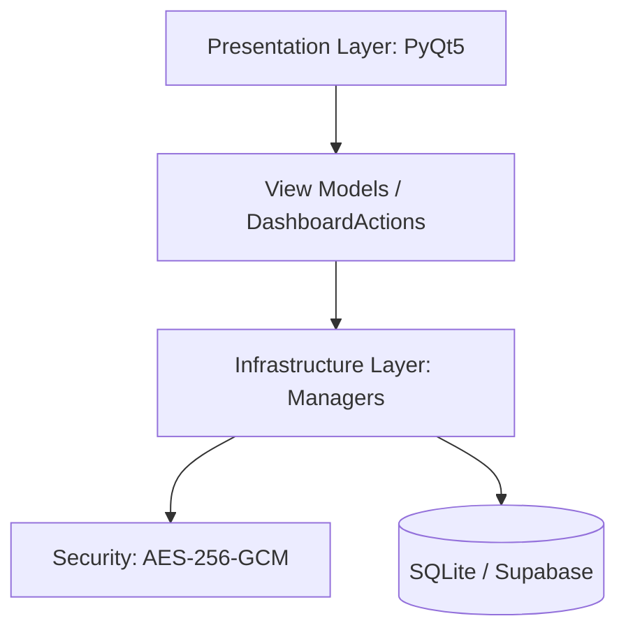

# 🛡️ Vultrax Core // Manual Maestro del Sistema

Bienvenido a la documentación técnica y operativa de **Vultrax Core**. Este manual ha sido diseñado para servir como brújula durante tus auditorías y sesiones de mantenimiento. Aquí encontrarás la explicación detallada de cómo cada engranaje del sistema trabaja para proteger tu identidad digital.

---

## 1. Arquitectura "Ghost-Ops" (Clean Architecture)

Vultrax Core sigue una arquitectura de capas estrictas para garantizar que la seguridad (el motor) esté separada de la interfaz (los visuales).

### Capas del Proyecto (`src/`)
1.  **`src/presentation`**: Contiene todo lo visual. Ventanas, diálogos, estilos CSS (QSS) y la lógica de los widgets.
2.  **`src/infrastructure`**: El corazón técnico. Aquí residen los "Managers" que hablan con la base de datos, manejan la sincronización y ejecutan el cifrado.
3.  **`src/domain`**: Contiene los mensajes de la app y las constantes compartidas.
4.  **`config/`**: Configuración de conexión con Supabase.

---

## 2. Mapa de Archivos Estratégicos

### Motor Central (`src/infrastructure/`)
- **`secrets_manager.py`**: El archivo más crítico. Maneja la creación de la DB local, el cifrado AES-256 y la auditoría de seguridad.
- **`sync_manager.py`**: Gestiona el espejo entre SQLite y Supabase Cloud. Implementa la lógica de lotes (batches) y validación de UUIDs.
- **`user_manager.py`**: Controla el login, el registro de usuarios y la validación de tokens 2FA.
- **`repositories/secret_repo.py`**: Implementa la persistencia y la validación de unicidad de servicios.

### Interfaz Táctica (`src/presentation/dashboard/`)
- **`dashboard_view.py`**: La ventana principal. Orquestador de todos los widgets del dashboard.
- **`dashboard_ui.py`**: Definición visual de los elementos (botones, layouts, tablas).
### Dashboard Masterclass
En el panel principal verás indicadores clave:
- **SYSTEM HEALTH**: Higiene de tus contraseñas.
- **AUTH INTEGRITY**: Cobertura de MFA.
- **RISK EXPOSURE**: Nivel de riesgo calculado.
- **AUDIT PROTOCOL**: Estado del rastreo de eventos.
- **`dashboard_actions.py`**: Ejecuta las órdenes del usuario. Utiliza hilos daemon para sincronización asíncrona (Ghost Sync).

---

## 3. Protocolos de Seguridad Persistente

### Cifrado de Datos
Vultrax Core utiliza **AES-256-GCM** (Galois/Counter Mode). 
- **Clave Maestra**: Nunca se guarda. Se deriva usando **PBKDF2** con 100,000 iteraciones y una sal única.
- **Integridad**: El modo GCM garantiza que si alguien intenta manipular tu base de datos SQLite directamente, el sistema detectará el cambio y bloqueará la lectura (Nodo Protegido).

### Auditoría (Logging)
Cada clic sensible genera un evento en la tabla `security_audit`. Los eventos se sincronizan en segundo plano y están protegidos contra errores de formato (UUID Validation).

---

## 4. Guía de Herramientas de Raíz (Root Scripts)

En la carpeta principal verás scripts `.py` para mantenimiento:
- **`apply_index_migration.py`**: Aplica la migración para garantizar la unicidad de servicios.
- **`cleanup_test_logs.py`**: Limpia registros de prueba inválidos en la auditoría.
- **`FACTORY_RESET.py`**: Limpia todo para empezar de cero.

---

> [!TIP]
> Durante tu revisión, mantén este manual abierto. Vultrax Core ha sido diseñado para ser modular y transparente para el operador técnico.
